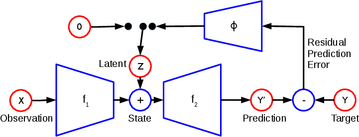
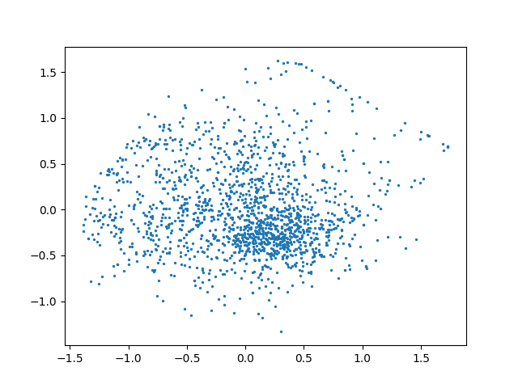
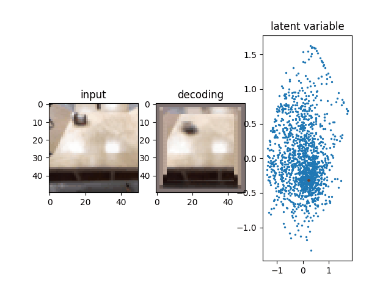
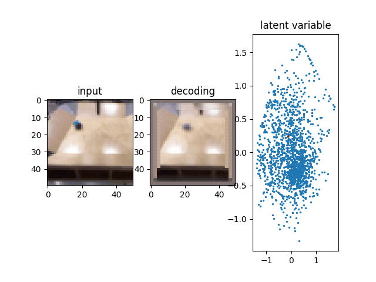

# EEN-with-Keras
facebook research의 Error-Encoding-Network을 keras로 구현하였습니다.


## Error Encoding Network

timeseries data의 uncertainty를  latent variable로 encoding하여, multi modal한 data를 학습할 수 있다.

## model structure



## latent variable




## result

각 decoding은 해당 latent variable(red)와 input에 대한 결과물입니다.

유사한 위치의 latent variable을 상대적으로 먼 거리의 latent variable보다 더 유사한 decoding 결과를 보여주고 있습니다.





## dependency

- tensorflow 1.3
- numpy
- matplotlib

## usage
- train

```python
python train.py [option]
```

- visualize
```python
python visualize.py [option]
```

## reference
- paper : https://arxiv.org/pdf/1711.04994.pdf
- github : https://github.com/mbhenaff/EEN


