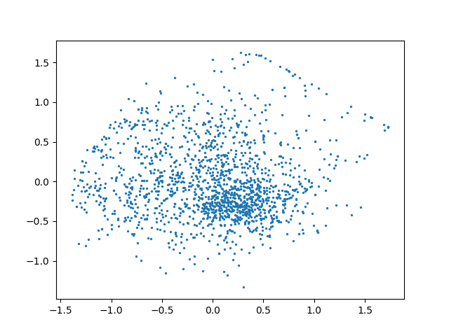

## Introduction

Facebook AI research implemented error encoding network by pytorch.

I want to EEN implemented by keras too.

But, There are people who have limited GPU resources. So, I reduced input image size and made it smaller network.

## Thanks to

I was sponsored by [EpiSys Science](http://episci-inc.com/).

This company has a passion for 'uncertainty detection' in deep learning. 

## Error_Encoding_Network

In the [paper](https://arxiv.org/pdf/1711.04994.pdf), it is based on a simple idea of disentangling components of the future state which are predictable.

As a result, it is able to consistently generate diverse predictions without the need for alternating minimization over a latent space or adversarial training.

## Model structure

Train latent variable model with alternating minimization.


## Latent variable




## Result

Each decoding image is a  combination of input image and latent variable(red point).

It shows the nearer latent variable is, the more similar decoding image is.
 


## Dependency

- tensorflow-gpu 1.3
- numpy
- matplotlib

## Usage

- train
```python
python train.py [option]
```
- visualize
```python
python visualize.py [option]
```

## Dataset

[Poke](http://ashvin.me/pokebot-website/)

## Reference
- paper : https://arxiv.org/pdf/1711.04994.pdf
- github : https://github.com/mbhenaff/EEN


